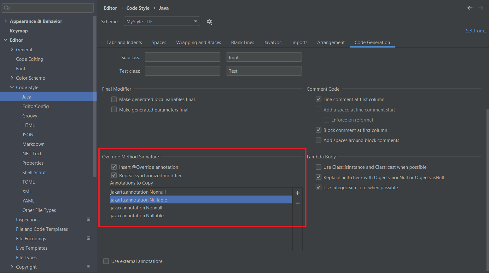
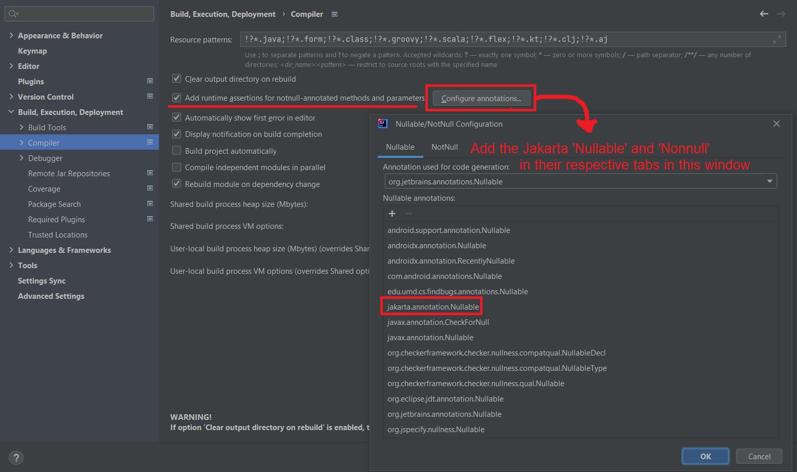

# Configuring annotations in IntelliJ

You'll want to make it so that `@Nonnull` and `@Nullable` are recognized by IntelliJ. The settings you'll want to change are highlighted here.

<figure><figcaption></figcaption></figure>

This first image makes it so that method overrides/implementations with missing annotations from their parent types show a warning, and allow you to automatically insert these missing annotations. Plus, when you use IntelliJ to automatically implement methods from a `abstract class` or `interface` these interfaces will be copied for you.

<figure><figcaption></figcaption></figure>

This second image makes it so the Jakarta `Nonnull` and `Nullable` annotations used in the project are recognized by IntelliJ. This allows us to have a basic system for tracking nullability. You'll also want to ensure the default annotation is the Jakarta one after you add it to the list.

Methods that can return `null` or parameters that may be `null` should be marked with `Nullable`. Any time one of these is used, it will warn you when you do not have an appropriate `null` check on a value.

Similarly, any method/parameter that should not be `null` should be marked with `Nonnull`. We use a plugin that generates `null` checks at compile time, so the contract for non-null is enforced at runtime.
